# Azure DevOps und GitHub Integration - Demo
Diese Demo zeigt folgende Aspekte der Integration zwischen Azure DevOps und GitHub:

- Nutzung von GitHub Copilot und Azure DevOps MCP Server zur Erstellung von Requirements und zugehörigen Tasks.
- Implementierung von Tasks mit GitHub Copilot.
- Verwaltung des Codes in GitHub Repositories mit Verknüpfungen zu Azure Boards Work Items.
- Automatisierung von Builds und Deployments mit Azure Pipelines.
- Nutzung des GitHub Coding Agents zur autonomen Implementierung von Features basierend auf Azure Boards Work Items.

## Inhaltsverzeichnis
- [Voraussetzungen](#voraussetzungen)
- [Was kann man zeigen?](#was-kann-man-zeigen)
  - [Harmonisierte Lizensierung](#harmonisierte-lizensierung)
  - [Erzeugung von Product Backlog Items](#erzeugung-von-product-backlog-items)
  - [Zerlegung von Anforderungen in Tasks](#zerlegung-von-anforderungen-in-tasks)
  - [Nächstes Requirement finden](#nächstes-requirement-finden)
  - [Nächstes Requirement übernehmen](#nächstes-requirement-übernehmen)
  - [Implementieren von Tasks](#implementieren-von-tasks)
  - [Copilot Code Review in GitHub](#copilot-code-review-in-github)
  - [Autonome Implementierung mit GitHub Coding Agent](#autonome-implementierung-mit-github-coding-agent)
  - [Build- und Deployment-Automatisierung mit Azure Pipelines](#build--und-deployment-automatisierung-mit-azure-pipelines)


## Voraussetzungen
- Azure DevOps Organisation und GitHub Enterprise (EMU) verbunden mit demselben Entra Tenant.
- Projekt in Azure DevOps.
- Organisation mit GitHub Repository.
- Integration von Azure DevOps und GitHub und aktivierte Verbindung zwischen Azure DevOps Projekt und GitHub Repository.
- Autolink Referenzen im GitHub Repository konfiguriert (AB#123 zeigt auf https://dev.azure.com/ORG/PROJECT/_workitems/edit/123).
- GitHub Copilot und GitHub Coding Agent aktiviert für die Nutzer.
- Azure DevOps MCP Server lokal konfiguriert.

[:back: zurück](#inhaltsverzeichnis)

## Was kann man zeigen?
Die Demo erstellt eine einfache statische Webseite mit einer Bildergalerie. Die Anforderungen für die Webseite werden als Product Backlog Items in Azure DevOps erstellt, in Tasks zerlegt und anschließend mit GitHub Copilot implementiert. Der Code wird in einem GitHub Repository verwaltet, das mit Azure DevOps verknüpft ist, so dass eine vollständige Nachvollziehbarkeit zwischen Anforderungen, Tasks und Codeänderungen gegeben ist:


Viele Demos verwenden den Azure DevOps MCP Server zur Interaktion zwischen GitHub Copilot und Azure DevOps. Dazu wurden einige vorgefertigte Prompts erstellt, die in diesem Repository unter `./.github/prompts/` zu finden sind. In den einzelnen Demos wird auf die notwendigen Prompt-Dateien verwiesen.

**Wichtig:** Vor der Ausführung sollte der Azure DevOps MCP Server lokal gestartet werden. Danach sollte man eine Abfrage im Copilot machen, z.B. "Auf welche Projekte in Azure DevOps habe ich Zugriff?", da bei der ersten Anfrage wird eine Authentifizierung über den Browser erforderlich sein. Hierbei unbedingt die gleiche Entra-Identität verwenden, die auch für den Zugriff auf Azure DevOps und GitHub genutzt wird, um eine reibungslose Integration zu gewährleisten. Macht man die Abfrage vor der Demo nicht, so kann es vorkommen, dass der MCP Server viele Authentifizierungsanfragen parallel erzeugt, was zu Verwirrung führen kann!

### Harmonisierte Lizensierung
Nutzer arbeiten mit Ihrer Entra-Identität, um auf beide Plattformen zuzugreifen. In der User-Übersicht in Azure DevOps werden die GitHub Enterprise Nutzer angezeigt, und die Lizenzen werden entsprechend zugeordnet:

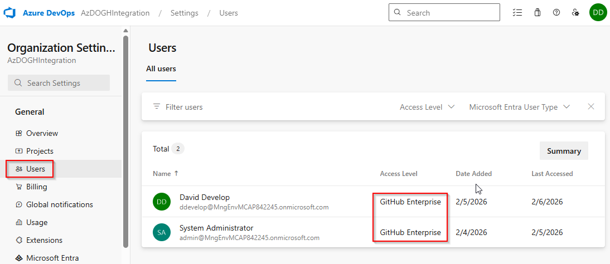

[:back: zurück](#inhaltsverzeichnis)

### Grundlegende Konfiguration von GitHub Copilot für Azure DevOps und GitHub
Um die Integration zwischen GitHub Copilot und Azure DevOps optimal zu nutzen, sollten einige Kontextinformationen in der Datei [./.github/copilot-instructions.md](./.github/copilot-instructions.md) hinterlegt werden. Diese Informationen stehen dann in allen Prompts zur Verfügung und ermöglichen es GitHub Copilot, die Antworten entsprechend zu formulieren.

In dieser Demo wird z.B. explizit auf die Nutzung der MCP Server hingewiesen, damit Prompts einfacher formuliert werden können.

[:back: zurück](#inhaltsverzeichnis)

### Erzeugung von Product Backlog Items
Für die Demo wurden Anforderungen für eine statische Webseite mit Bildergalerie mit Hilfe des Planning Agents erstellt (nicht Teil der Demo). Diese sind in der Datei [requirements.md](./requirements.md) dokumentiert.

**Hinweis:** Der Ablauf der Planung kann in der Datei [requirements-planning.md](./chats/requirements-planning.md) nachvollzogen werden, falls notwendig.

Der Prompt in der Datei [./.github/prompts/create-requirements.prompt.md](./.github/prompts/create-requirements.prompt.md) kann genutzt werden, um die zuvor geplanten Anforderungen als Product Backlog Items in Azure DevOps zu erstellen.

```
Prompt: /create-requirements für Datei #requirements.md
```

Als Ergebnis sollten fünf Product Backlog Items in Azure DevOps erstellt werden, die den Anforderungen aus der Datei entsprechen. Im Gegensatz zur Datei `requirements.md` sind die Items allerdings als User Stories formuliert und enthalten keine technischen Details (siehe Prompt-Datei).

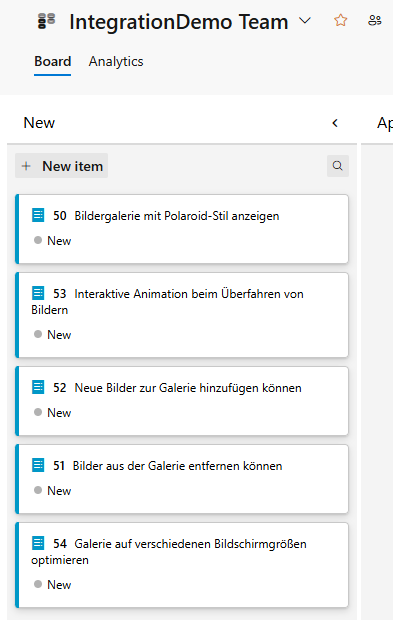
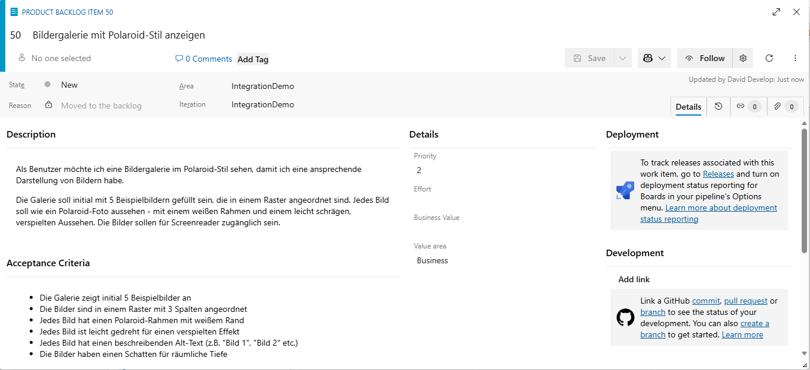

Nach der Erstellung der Product Backlog Items sollten diese in den Zustand "Approved" versetzt werden. Ein Product Owner würde in einem realen Szenario die Anforderungen prüfen und entscheiden, ob sie sinnvoll sind (Zustand "Approved"), die überarbeitet werden müssen oder sie irrelevant sind (Zustand "Removed"). Zusätzlich kann man hier schon sehen, dass Copilot die Reihenfolge der Anforderungen nicht immer optimal wählt und diese im Backlog entsprechend neu sortieren.

[:back: zurück](#inhaltsverzeichnis)

### Zerlegung von Anforderungen in Tasks
Nachdem die Product Backlog Items erstellt wurden, können diese mit einem weiteren Prompt in der Datei [./.github/prompts/create-tasks.prompt.md](./.github/prompts/create-tasks.prompt.md) in Tasks zerlegt werden.

```
Prompt: /create-tasks
```

Als Ergebnis sollten zu jedem Product Backlog Item mehrere Tasks als Child-Links in Azure DevOps erstellt werden, die die notwendigen Entwicklungsschritte abbilden und technische Informationen enthalten. Die Tasks sollten so formuliert sein, dass sie sich gut iterativ umsetzen lassen (siehe Prompt-Datei).

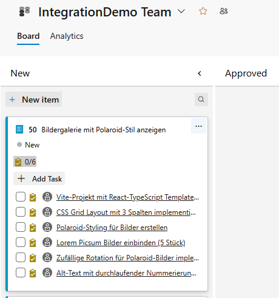
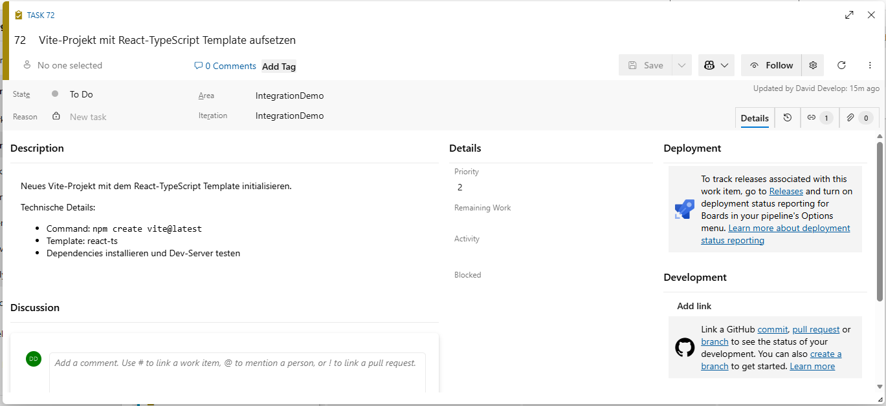

[:back: zurück](#inhaltsverzeichnis)

### Nächstes Requirement finden
Über den Prompt in der Datei [./github/prompts/get-next-requirement.prompt.md](./.github/prompts/get-next-requirement.prompt.md) kann der nächste offene Requirement (Product Backlog Item) abgefragt werden.

```
Prompt: /get-next-requirement
```

Natürlich können auch andere Formulierungen verwendet werden. Der Einfachheit halber wird in der Demo nicht mit Sprints gearbeitet, obwohl GitHub Copilot in der Regel auch die Sprint-Zugehörigkeit berücksichtigen würde, wenn diese Informationen in Azure DevOps gepflegt sind. In einem realen Szenario würde man im Prompt z.B. explizit auf Anforderungen im Zustand "Committed" verweisen, die sich im aktuellen Sprint eines bestimmten Teams befinden. Das Team sollte man im besten Fall in den allgemeinen Kontextinformationen in der Datei [./.github/copilot-instructions.md](./.github/copilot-instructions.md) hinterlegen, damit es in allen Prompts zur Verfügung steht.

[:back: zurück](#inhaltsverzeichnis)

### Nächstes Requirement übernehmen
Möchte man an einem Requirement arbeiten, so kann man den Prompt in der Datei [./github/prompts/start-next-requirement.prompt.md](./.github/prompts/start-next-requirement.prompt.md) verwenden. Man kann entweder gezielt ein bestimmtes Requirement übernehmen oder sich einfach das nächste offene Requirement geben lassen, um es zu übernehmen. In beiden Fällen werden die notwendigen Informationen zum Requirement abgefragt und in den Kontext übernommen, damit sie für die anschließende Implementierung zur Verfügung stehen.

**Nächstes verfügbares Requirement übernehmen:**
```
Prompt: /start-next-requirement
```

**Bestimmtes Requirement übernehmen:**
```
Prompt: /start-next-requirement PBI 123
```

Der Prompt berücksichtigt dabei, dass nur Anforderungen im Zustand "Approved" übernommen werden sollten. Dies kann man demonstrieren, indem man manuell ein neues PBI im Zustand "New" erstellt und dann versucht, dieses mit dem Prompt zu übernehmen. GitHub Copilot sollte dann ablehnen, dieses Requirement zu übernehmen, da es nicht den Kriterien entspricht. In einem realen Szenario würde man hier ggf. nur Elemente aus dem aktuellen Sprint übernehmen oder zusätzliche Schritte vorsehen (z.B. Übernahme in den Sprint). Alternativ könnte man auch über ein benutzerdefiniertes Feld oder einen Zustand arbeiten, der das Refinement abbildet, so dass nur "ready" Anforderungen übernommen werden können.

Nach der Ausführung kann man in Azure DevOps zeigen, dass die Anforderung und alle Kind-Tasks dem aktuellen Benutzer zugewiesen wurden und die Anforderung tatsächlich im Zustand "Committed" ist.

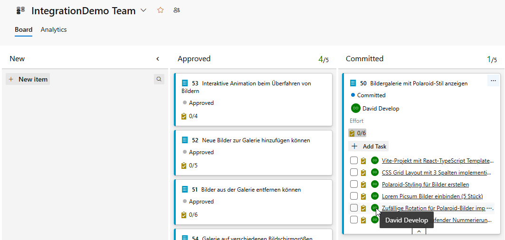

[:back: zurück](#inhaltsverzeichnis)

### Implementieren von Tasks
Nachdem man eine Anforderung übernommen hat, kann man über den Prompt in der Datei [./.github/prompts/implement-next-task.prompt.md](./.github/prompts/implement-next-task.prompt.md) den nächsten offenen Task zum übernommenen Requirement implementieren. Der Prompt führt durch die notwendigen Schritte, um die Aufgabe zu auf einem neuen Feature-Branch implementieren, zu testen und die Änderungen zu committen und zu pushen.

```
Prompt: /implement-next-task
```

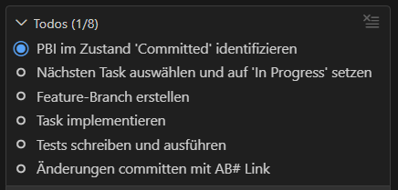
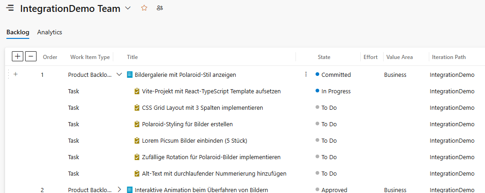

Sobald ein Task implementiert wurde, kann man die volle Nachvollziehbarkeit zwischen Azure DevOps und GitHub zeigen. Der Task enthält Links zu den Commits im GitHub Repository, die Commits enthalten die passenden Referenzen im Format "AB#123" zum Task in Azure DevOps. Sofern die Autolink Referenzen korrekt konfiguriert sind, kann man von GitHub direkt zu den verknüpften Work Items in Azure DevOps navigieren.

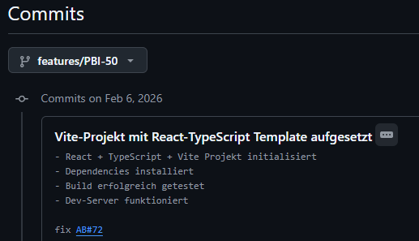
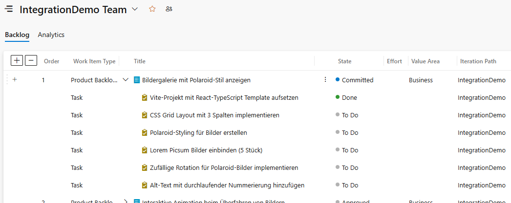
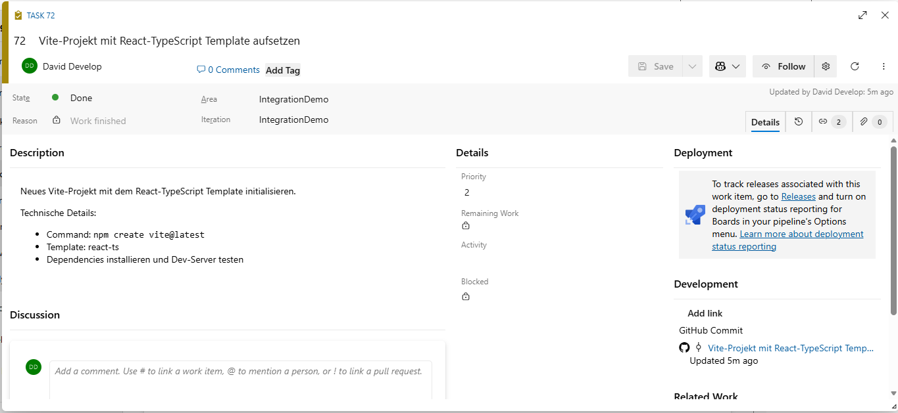

Alternativ kann man GitHub Copilot auch auffordern, alle offenen Tasks in der richtigen Reihenfolge zu implementieren. Dazu kann der Prompt [./.github/prompts/implement-all-tasks.prompt.md](./.github/prompts/implement-all-tasks.prompt.md) verwendet werden. Der Prompt stellt auch sicher, dass die Tasks vollständig nacheinander abgearbeitet und nicht mehrere Implementierungen zusammengefasst werden.

```
Prompt: /implement-all-tasks
```

Bei der Nutzung dieses Prompts kann man ebenfalls demonstrieren, wie GitHub Copilot über den GitHub MCP Server die Implementierung einer vollständigen Anforderung mit einem Pull Request abschließt und diesen sauber mit der Anforderung in Azure DevOps verknüpft.

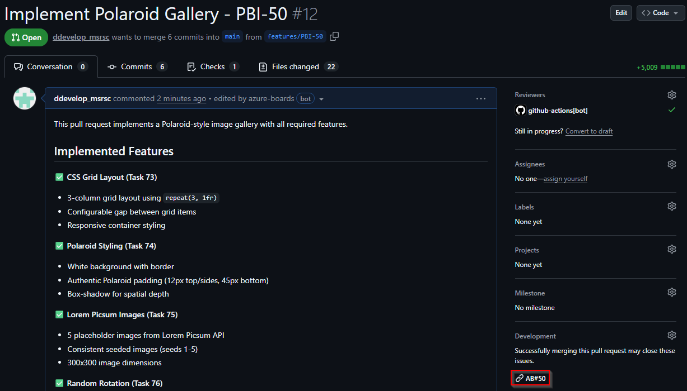
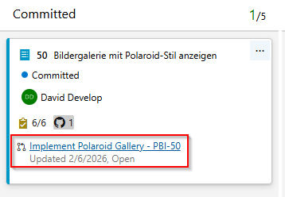

[:back: zurück](#inhaltsverzeichnis)

### Copilot Code Review in GitHub
In einem erstellen Pull Request (z.B. über den Prompt `/implement-all-task`) kann man dann GitHub Copilot als Reviewer hinzufügen und den Prozess zeigen.

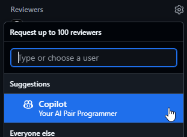
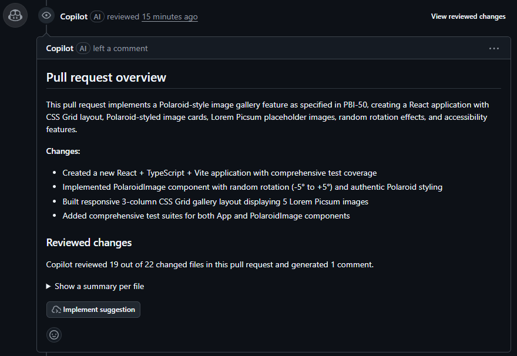
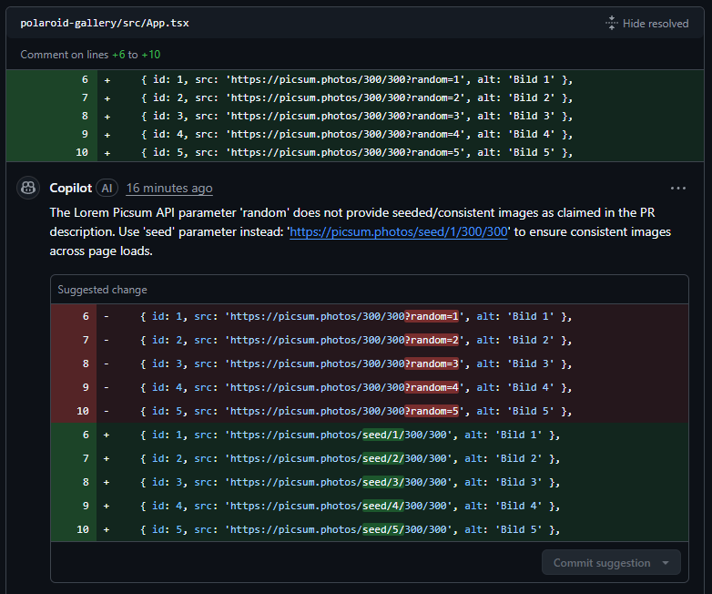

[:back: zurück](#inhaltsverzeichnis)

### Autonome Implementierung mit GitHub Coding Agent
Mit der Integration von Azure DevOps und GitHub ist es möglich, den GitHub Coding Agent zu nutzen, um Features basierend auf Azure Boards Work Items autonom zu implementieren. Dazu müssen die Work Items allerdings so formuliert sein, dass sie ausreichend Kontext für die Implementierung bieten. Über den Prompt in der Datei [./.github/prompts/create-coding-agent-requirement.prompt.md](./.github/prompts/create-coding-agent-requirement.prompt.md) kann man eine Anforderung ohne Tasks erstellen lassen (Coding Agent arbeitet immer auf einem Work Item, nicht auf einer Work Item Hierarchie):

```
Prompt: /create-coding-agent-requirement
```

Anschließend kann man diese Anforderung in Azure DevOps zeigen, sie in den Zustand "Committed" versetzen (nicht zwingend notwendig) und sie dann über die Schaltfläche *Create a pull request with GitHub Copilot* an den Coding Agent übergeben:

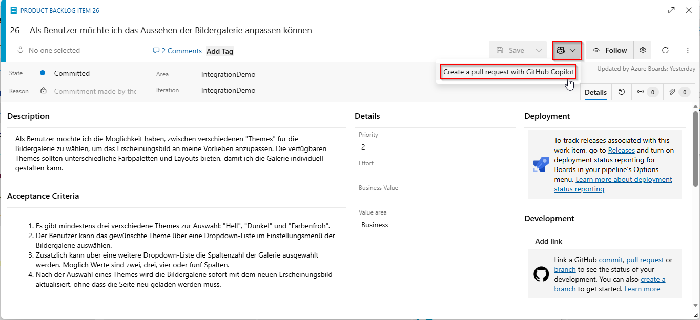
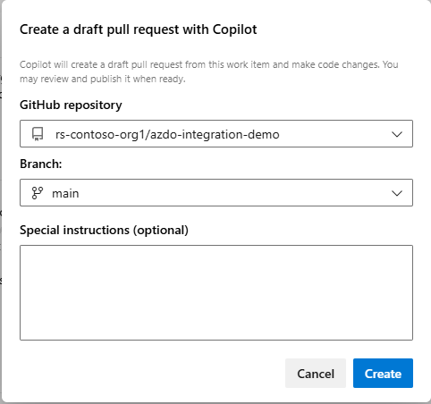

**Hinweis:** Im zweiten Schritt werden in Zukunft auch Custom Agents auswählbar sein.

Der Status des Coding Agents ist direkt in Azure DevOps sichtbar:

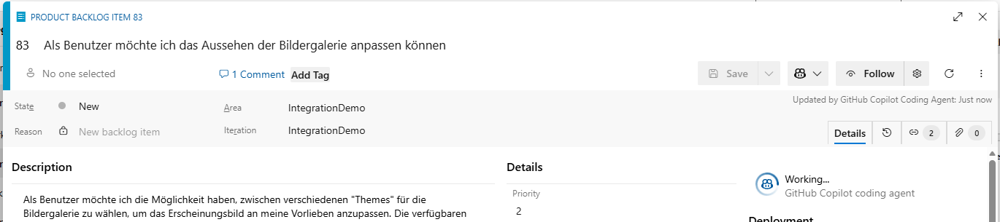

Außerdem kann man den Fortschritt des Coding Agents direkt in GitHub verfolgen:

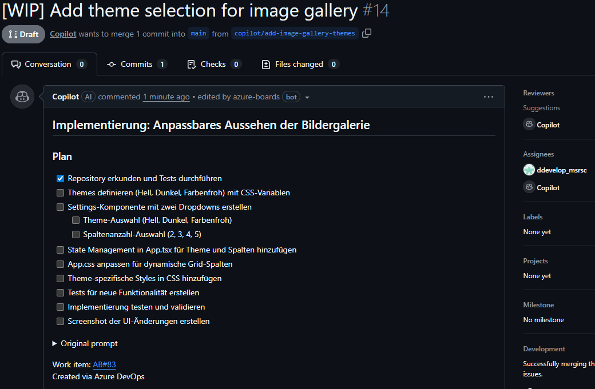

[:back: zurück](#inhaltsverzeichnis)

### Build- und Deployment-Automatisierung mit Azure Pipelines
Um die Build- und Deployment-Automatisierung mit Azure Pipelines zu demonstrieren, müssen erst ein paar Vorbereitungen getroffen werden:

1. Azure-Umgebung vorbereiten
   - Eine Azure Subscription als Ziel für das Deployment erzeugen.
   - Ein Service Principal mit den notwendigen Berechtigungen für die Subscription erstellen. Der Einfachheit halber geht die Demo davon aus, dass das Service Principal die *Contributor* Rolle erhält, damit die notwendigen Ressourcen (inkl. Resource Group) automatisch durch die Pipeline erstellt werden können. Dies kann ebenfalls über die Azure CLI erfolgen:  
     ```
     az ad sp create-for-rbac --name <ServicePrincipalName> --role Contributor --scopes /subscriptions/<SubscriptionId>
     ```

2. Service Connection in Azure DevOps erstellen
   - Eine neue Service Connection im Azure DevOps Projekt vom Typ "Azure Resource Manager" mit Workload Identity Federation (OIDC) erstellen (siehe https://learn.microsoft.com/en-us/azure/devops/pipelines/release/configure-workload-identity?view=azure-devops&tabs=app-registration).

Sobald die notwendigen Vorbereitungen getroffen wurden, kann die vorbereitete Pipeline in der Datei [./.pipelines/ci-cd.yaml](./.pipelines/ci-cd.yaml) aktiviert werden. Die Pipeline kann auf folgende Weise genutzt werden:

1. Manuell über die Azure DevOps Oberfläche, um den Prozess zu demonstrieren.
2. Als Pull Request Gate, das in jedem Pull Request in den Main-Branch ausgeführt wird. Dazu muss der `pr`-Trigger in Zeile 17 auskommentiert/entfernt und der Trigger in den Zeilen 20 bis 31 aktiviert werden. Die Trigger-Definition sieht dann wie folgt aus:
   ```yaml
   pr:
     branches:
       include:
         - main
     paths:
       exclude:
         - .github/**
         - .pipelines/**
         - .vscode/**
         - assets/**
         - chats/**
         - README.md
   ```

   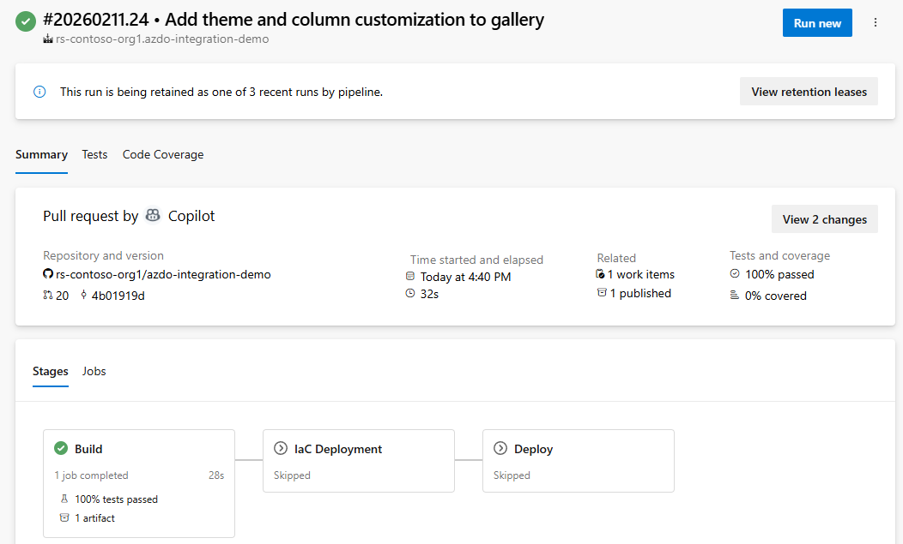
   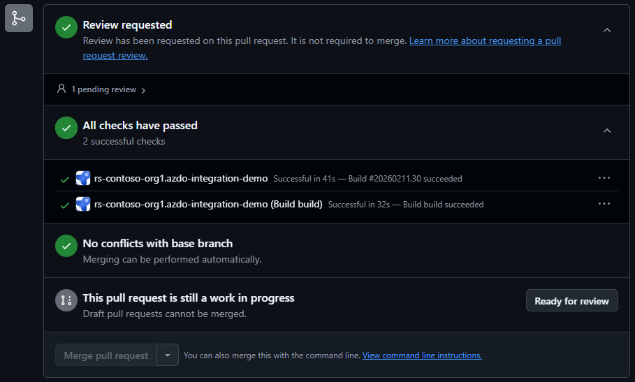

3. Als CI/CD-Pipeline, die automatisch bei jedem Merge in den Main-Branch ausgelöst wird. Dazu muss der Trigger in Zeile 1 auskommentiert/entfernt und der Trigger in den Zeilen 4 bis 15 aktiviert werden. Die Trigger-Definition sieht dann wie folgt aus:
   ```yaml
   trigger:
     branches:
       include:
         - main
     paths:
       exclude:
         - .github/**
         - .pipelines/**
         - .vscode/**
         - assets/**
         - chats/**
         - README.md
   ```

   Zusätzlich muss in Zeile 53 der Name der zuvor erstellen Service Connection anstelle des Platzhalters `<your-service-connection>` eingetragen werden, damit die Pipeline sich mit Azure verbinden und die notwendigen Ressourcen erstellen kann.

   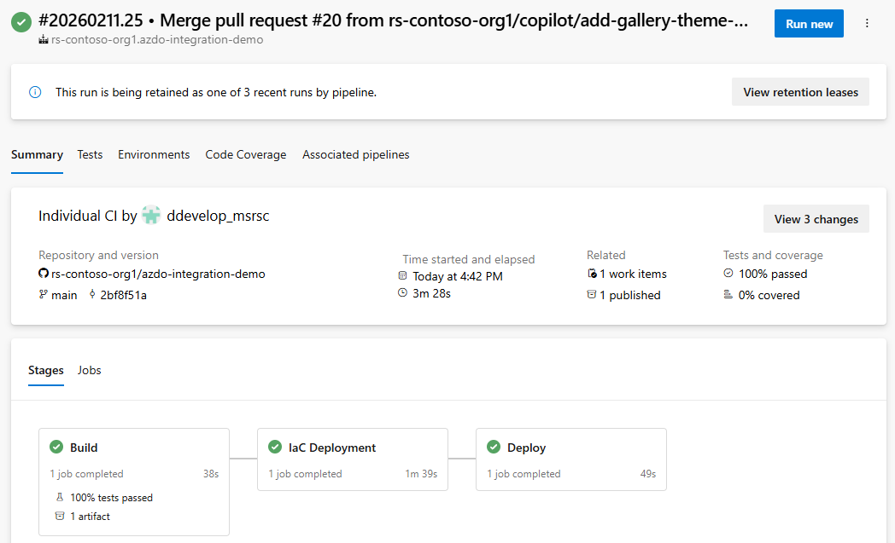

Die Pipeline ist so konfiguriert, dass je nach Trigger unterschiedliche Schritte ausgeführt werden:
- `Build`-Stage - immer ausgeführt  
  Installiert und aktiviert die notwendigen Node.js-Version, installiert die Abhängigkeiten, führt den Build und die Tests aus und erzeugt ein Build-Artefakt für das spätere Deployment.
- `IaC`-Stage - nur auf `main`-Branch  
  Erstellt die notwendige Infrastruktur in Azure mit Hilfe von Bicep (Resource Group und Static Web App) und bereitet Variablen für das Deployment der Applikation vor.
- `Deploy`-Stage - nur auf `main`-Branch  
  Führt das Deployment der Applikation auf die zuvor erstellte Azure Static Web App durch und gibt am Ende die URL der Webseite im Log aus.

[:back: zurück](#inhaltsverzeichnis)